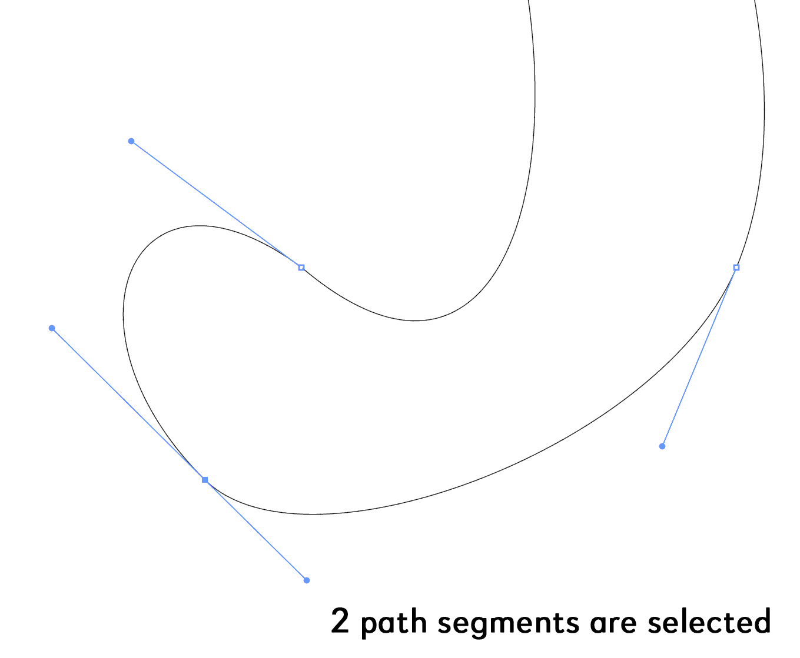

# Bez.js for illustrator
Bez.js is a library of path-related functions for Adobe Illustrator. It doesn't do anything by itself. Currently I use it for my dasher script and also the example script `Add Path Point At Extrema.js`.

 

## Installation

Download the [latest release](https://github.com/mark1bean/dasher-for-illustrator/releases/latest/download/add-path-point-at-extrema.zip). From Illustrator, run the script file `Add Path Point At Extrema.js`. Make sure `Bez.js` is in the same folder so it can find it.

 

## Quick Start

To use it straight away, just make a selection in Illustrator and run `Add Path Point At Extrema.js` script.

>You can select just the path segments that you wish to add the anchor points to, or you can select the whole path, or paths.

Remember: it won't work unless `Bez.js` are in the same folder with the script.

 

## Why this project?
Some on the adobe community forum asked for a script that added an anchor point at the top extrema of a path. I had recently created Bez.js for [another project](https://github.com/mark1bean/dasher-for-illustrator). It already had some of the logic required for this and so I decided to extend it.

 

## Please help with testing

As of 2022-03-14, this script is hardly tested at all, and only on my machine. Adobe Illlustrator 2022 (v26), MacOS 12.2.1.

Please post any issues you come across.

 

## System requirements

As of 2022-01-24, tested only on AI version 26.1 (MacOS 12.1).

 

## Acknowledgements

Thanks so much to Hiroyuki Sato, for his bezier maths code from his excellent [Divide (length).js script](https://github.com/Shanfan/Illustrator-Scripts-Archive/blob/master/jsx/Divide%20(length).jsx).

To calculate extrema, I code from [Timo's answer on stackexchange](https://stackoverflow.com/questions/2587751/an-algorithm-to-find-bounding-box-of-closed-bezier-curves). Thanks Timo.