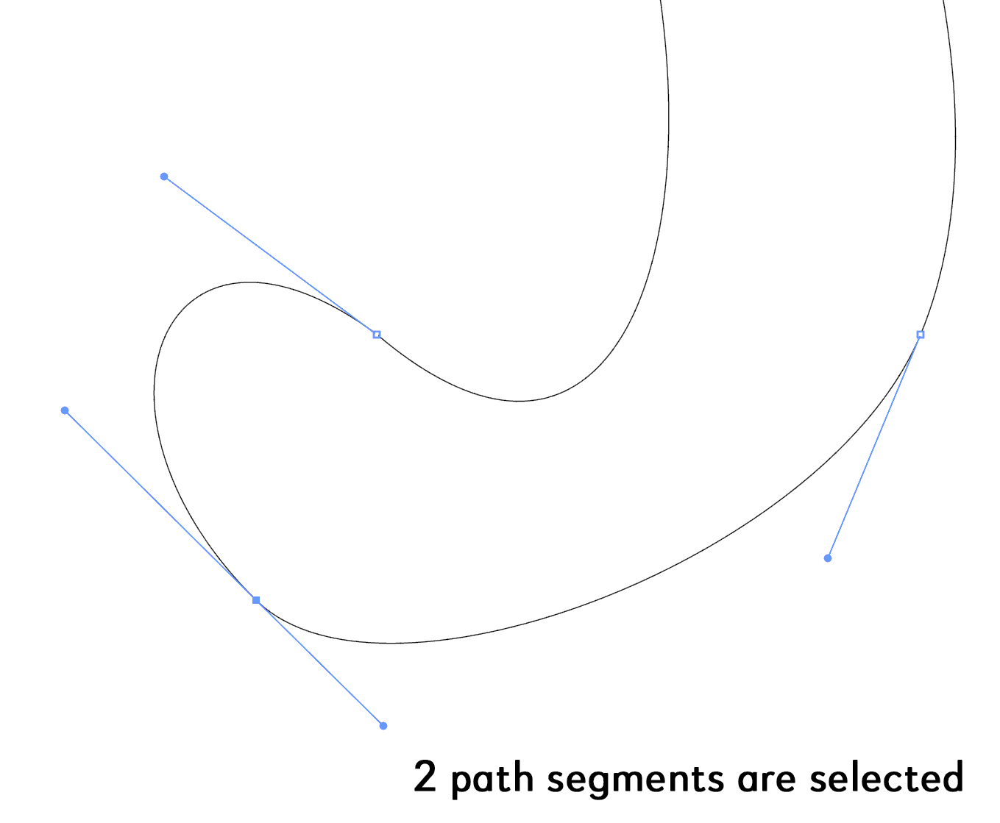
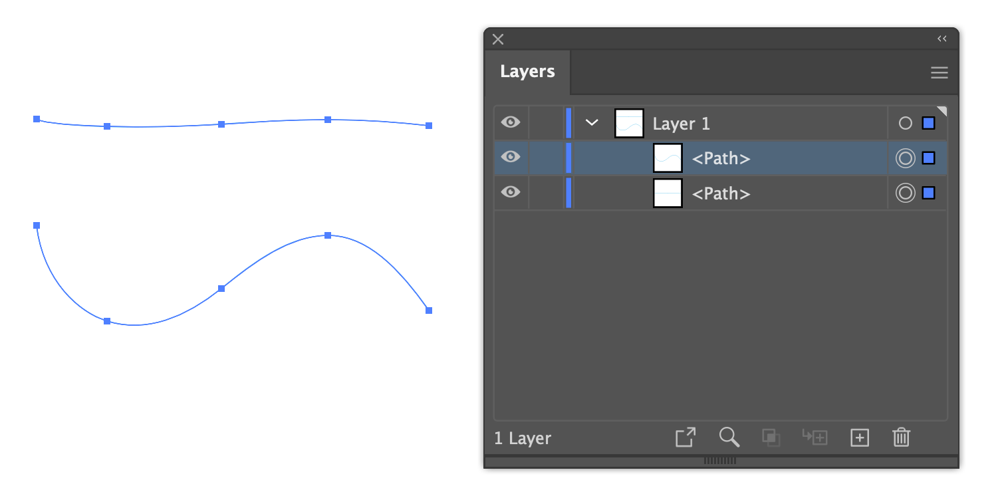
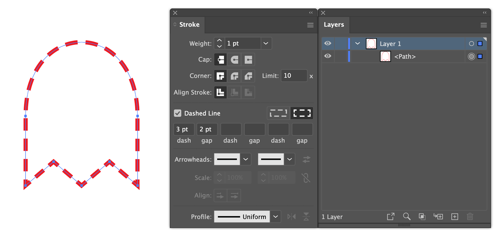

# Bez.js for Illustrator

Bez.js is a library of path-related functions for Adobe Illustrator.

So far I have used it in my [Dasher project](https://github.com/mark1bean/dasher-for-illustrator) script as well as example scripts *Add Path Point At Extrema.js* and *Interpolate Between Paths.js*.







$~$
***

## Installation

Download the [latest release](https://github.com/mark1bean/bez-for-illustrator/releases/latest/download/bez-for-illustrator.zip). Store the scripts where you normally store your Illustrator script. Make sure `Bez.js` is in the same folder as `Add Path Point At Extrema.js` so it can find it.

$~$
***

## Example Usage

### Add Path Point At Extrema

Make a selection in Illustrator and run `Add Path Point At Extrema.js` script. You can select just the path segments that you wish to add the anchor points to, or you can select the whole path, or paths.

>Remember: it won't work unless `Bez.js` are in the same folder with the script, or if you change the path at the start of the script.

### Interpolate Between Paths

Select two compatible path items in Illustrator and run `Interpolate Between Paths.js` script. Edit the script to use in one of two ways:

Example 1: make 6 interpolated paths

```javascript
var items = Bez.pathItemsFromInterpolation(doc.selection[0], doc.selection[1], 6);
```

Example 2: make a single new path at 20% position (ie. t == 0.2)

```javascript
var items = Bez.pathItemsFromInterpolation(doc.selection[0], doc.selection[1], undefined, 0.2);
```

>Note: path items have the same number of path points.

$~$
***

## Why this project?

Someone the adobe community forum asked for a script that added an anchor point at the top extrema of a path. I had recently created Bez.js for [another project](https://github.com/mark1bean/dasher-for-illustrator). It already had some of the logic required for this and so I decided to extend it.

$~$
***

## Please help with testing

As of 2022-03-14, this script is hardly tested at all, and only on my machine. Adobe Illlustrator 2022 (v26), MacOS 12.2.1.

Please post any issues you come across.

$~$
***

## System requirements

As of 2022-01-24, tested only on AI version 26.1 (MacOS 12.1).

$~$
***

## Acknowledgements

Thanks so much to Hiroyuki Sato, for his bezier maths code from his excellent [Divide (length).js script](https://github.com/Shanfan/Illustrator-Scripts-Archive/blob/master/jsx/Divide%20(length).jsx).

To calculate extrema, I use code from [Timo's answer on stackexchange](https://stackoverflow.com/questions/2587751/an-algorithm-to-find-bounding-box-of-closed-bezier-curves). Thanks Timo.
