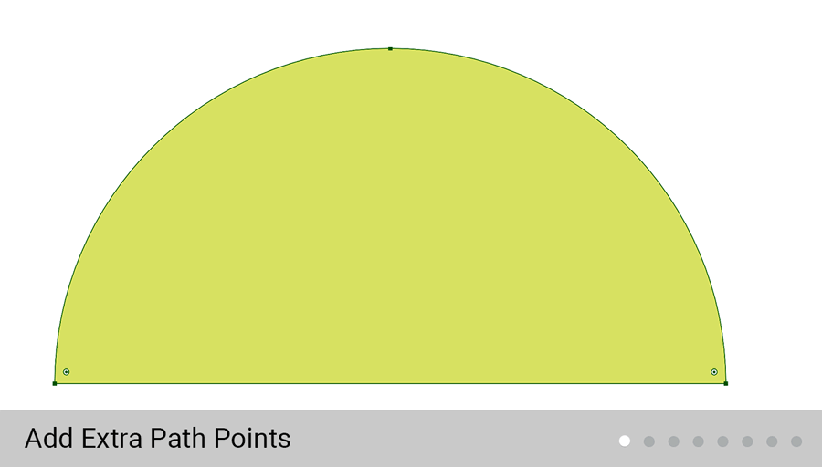
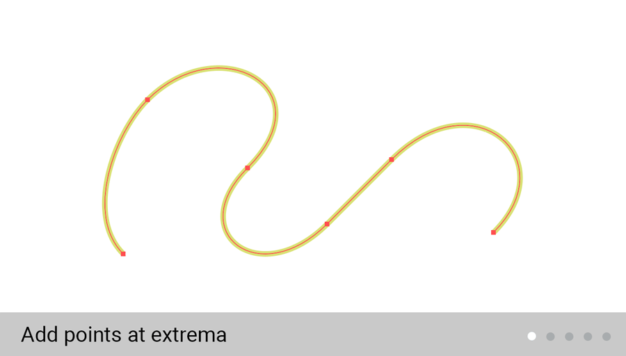
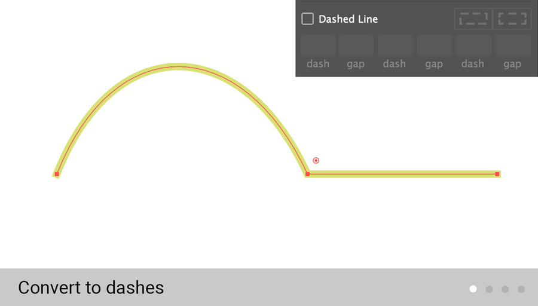
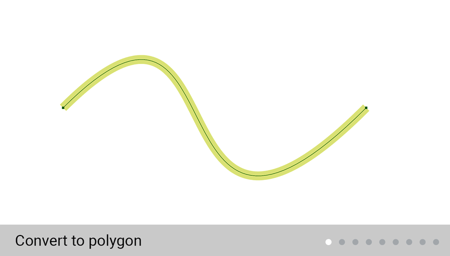
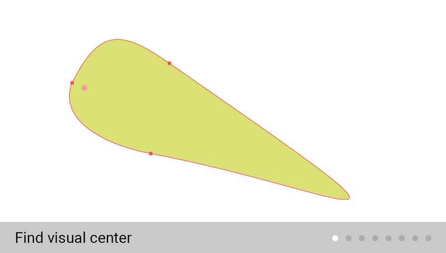
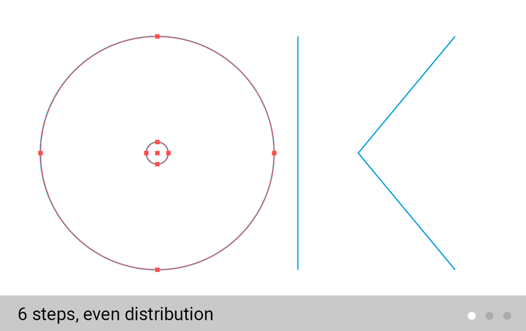
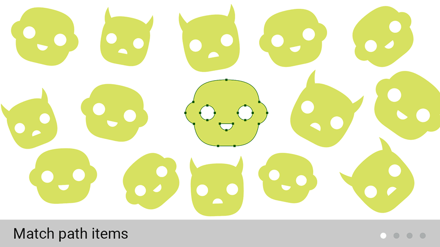

# Bez.js for Illustrator

Bez.js is a library of path-related functions for Adobe Illustrator.

Quickest way to see what you can do with Bez is look at the images below, and explore the example scripts:

- [Add Extra Path Points.js](<examples/Add Extra Path Points.js>)
- [Add Path Point At Extrema.js](<examples/Add Path Point At Extrema.js>)
- [Convert Path To Dashes.js](<examples/Convert Path To Dashes.js>)
- [Convert Path To Polygon.js](<examples/Convert Path To Polygon.js>)
- [Each Point.js](<examples/Each Point.js>)
- [Find Visual Center.js](<examples/Find Visual Center.js>)
- [Interpolate Between Paths.js](<examples/Interpolate Between Paths.js>)
- [Match Path Items.js](<examples/Match Path Items.js>)

Add Extra Path Points.js

Add Path Point At Extrema.js

Convert Path To Dashes.js

Convert Path To Polygon.js

Find Visual Center.js

Interpolate Between Paths.js

Match Path Items.js

$~$
***

## Installation

Download the [latest release](https://github.com/mark1bean/bez-for-illustrator/releases/latest/download/bez-for-illustrator.zip). Store the scripts where you normally store your Illustrator script. Make sure the `//@include "library/Bez.js"` directive at the top of your script is a valid path (can be relative or absolute) to the Bez.js file.

$~$
***

## System requirements

As of 2026-04-01, tested only on AI version 30.2.1 (MacOS 26.3.1).

$~$
***

## Acknowledgements

Thanks so much to Hiroyuki Sato, for his bezier maths code from his excellent [Divide (length).js script](https://github.com/Shanfan/Illustrator-Scripts-Archive/blob/master/jsx/Divide%20(length).jsx).

To calculate extrema, I use code from [Timo's answer on stackexchange](https://stackoverflow.com/questions/2587751/an-algorithm-to-find-bounding-box-of-closed-bezier-curves). Thanks Timo!

To find visual center I adapt Volodymyr Agafonkin's [PolyLabel](https://github.com/mapbox/polylabel) and [TinyQueue](https://github.com/mourner/tinyqueue). Thanks Volodymyr!
